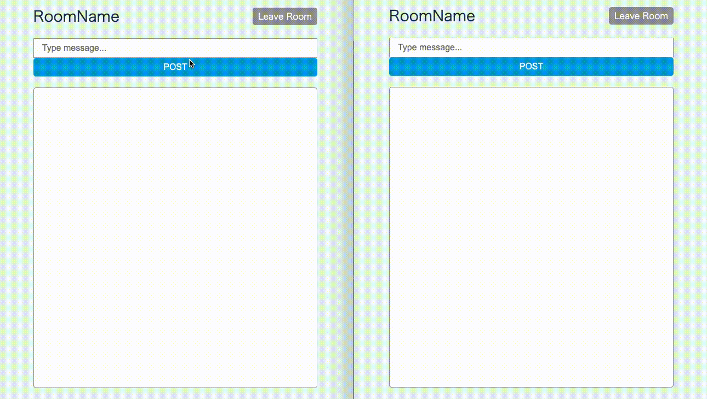

# websocket-chat

## overview

websocketを用いたチャットのサンプル。


## feature

- server
    - ユーザ作成
    - ログイン
    - room作成
    - チャット
- client
    - room作成
    - チャット

## how to start

```shell
// DBの起動
$ docker-compose up -d

// サーバの起動
$ cd server
$ go run main.go

// クライアントの起動
$ cd client
$ npm install
$ npm start

```